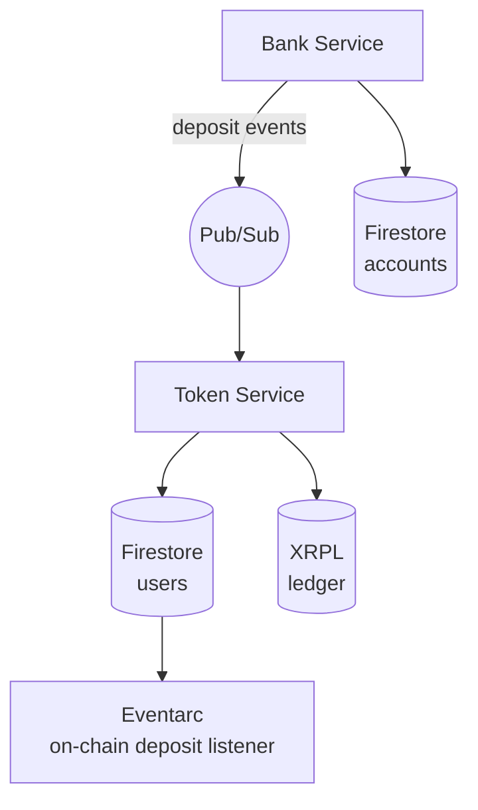

# XRPL Stablecoin Service

A production-grade stablecoin issuance platform on the [XRP Ledger](https://xrpl.org/). The system enables 1:1 fiat-backed token minting, redemption, and custody through two cooperating microservices deployed on Google Cloud Run.

## Overview

The platform bridges traditional banking with decentralized finance by providing a complete lifecycle for fiat-backed stablecoins:

1. **Fiat on-ramp** — Users deposit fiat currency via bank transfers; the system automatically credits their balance
2. **Token minting** — Fiat balance is exchanged 1:1 for stablecoins minted on the XRPL
3. **Token redemption** — On-chain tokens are burned and the equivalent fiat balance is restored
4. **Fiat off-ramp** — Users withdraw fiat to whitelisted bank accounts
5. **Token transfers** — Deposit and withdraw tokens to/from external XRPL wallets

## Architecture

### Bank Service

A simulated banking system managing accounts, virtual accounts, and fund transfers. Supports both personal and corporate account types. Corporate accounts can create virtual accounts for segregated fund collection, with automatic sweep to the parent account.

When a corporate account receives a deposit, the Bank service publishes an event via **Cloud Pub/Sub** to notify the Token service.

### Token Service

The stablecoin core responsible for user onboarding, wallet provisioning, balance management, exchange operations, and withdrawals. Handles the full token lifecycle from minting to burning.

**Eventarc** monitors Firestore for new entries in the `tokenTransactions` collection, enabling automatic processing of inbound on-chain token deposits from external wallets.

## Key Features

### Multi-layer Authentication & Security

- **Firebase Identity Platform** session cookies with email verification
- **KYC verification** gate for financial operations
- **Multi-factor authentication** (MFA) — login-level and per-operation MFA tokens
- **Withdrawal whitelists** for both bank accounts and XRPL addresses

### Pluggable Transaction Signing

XRPL transactions are signed using **ed25519**. The signing backend is configurable via `SIGNING_PROVIDER`:

| Provider | Description |
| --- | --- |
| **Secret Manager** (`sm`) | Stores the issuer seed in Google Cloud Secret Manager; signing is performed in-process |
| **Cloud KMS** (`kms`) | Delegates signing to Google Cloud KMS; the private key never leaves the HSM |

The signing service uses lazy dynamic imports, loading only the selected provider at runtime.

### Event-driven Processing

- **Pub/Sub** push subscriptions deliver bank deposit events to the Token service for automatic fiat balance crediting
- **Eventarc** triggers on Firestore document creation to process inbound XRPL token deposits
- Idempotency keys prevent duplicate processing of events

### Stablecoin Operations

- 1:1 fiat-to-token exchange with on-chain minting via `Payment` transactions
- 1:1 token-to-fiat exchange with on-chain burning
- Automatic TrustLine management for token holders
- On-chain balance queries directly from the XRPL (no local balance tracking)

## Tech Stack

| Layer | Technology |
| --- | --- |
| Runtime | Node.js (ESM) + TypeScript |
| Framework | Express 5 |
| Blockchain | XRPL (xrpl.js) |
| Auth | Firebase Identity Platform |
| Database | Cloud Firestore |
| Messaging | Cloud Pub/Sub, Eventarc |
| Secrets | Cloud Secret Manager, Cloud KMS |
| Deployment | Cloud Run via Cloud Build |
| API docs | OpenAPI 3.0 + Swagger UI |
| Testing | Vitest + Supertest |
| Linting | Biome |

## API Surface

### Token Services

| Method | Endpoint | Description |
| - | - | - |
| POST | `/api/v1/auth/session` | Create session from Firebase ID token |
| GET | `/api/v1/users/me` | Get or create user profile |
| POST | `/api/v1/users/me/wallet` | Provision XRPL wallet |
| POST | `/api/v1/users/me/virtual-account` | Set up virtual bank account |
| GET | `/api/v1/tokens` | List available stablecoins |
| POST | `/api/v1/tokens/:id/trustline` | Establish TrustLine |
| GET | `/api/v1/balance/fiat` | Fiat balance |
| GET | `/api/v1/balance/tokens` | Token balances with TrustLine status |
| POST | `/api/v1/exchange/fiat-to-xrp` | Mint tokens (fiat → token) |
| POST | `/api/v1/exchange/xrp-to-fiat` | Burn tokens (token → fiat) |
| POST | `/api/v1/withdraw/fiat` | Withdraw to bank account |
| POST | `/api/v1/withdraw/xrp` | Withdraw tokens to external wallet |
| `*` | `/api/v1/whitelist/*` | Manage withdrawal whitelists |
| `*` | `/api/v1/kyc/*` | KYC verification |
| `*` | `/api/v1/mfa/*` | MFA token management |

### Bank Services

| Method | Endpoint | Description |
| - | - | - |
| POST | `/api/v1/accounts` | Open account |
| POST | `/api/v1/accounts/login` | Authenticate |
| GET | `/api/v1/accounts/me` | Account info |
| POST | `/api/v1/transfers` | Transfer funds |
| POST | `/api/v1/atm/deposit` | Cash deposit |
| POST | `/api/v1/atm/withdrawal` | Cash withdrawal |
| `*` | `/api/v1/accounts/me/virtual-accounts/*` | Virtual account management (corporate) |
| GET | `/api/v1/transactions` | Transaction history |

Both services expose interactive API documentation at `/api-docs`.

## Deployment

The project ships with a `cloudbuild.yaml` that orchestrates the full deployment pipeline:

1. Deploy Bank service to Cloud Run
2. Deploy Token service with the Bank service URL injected
3. Configure Pub/Sub topic and push subscription
4. Configure Eventarc trigger for Firestore

All secrets are managed through Google Cloud Secret Manager — no credentials are stored in code or environment variables.

## License

MIT
